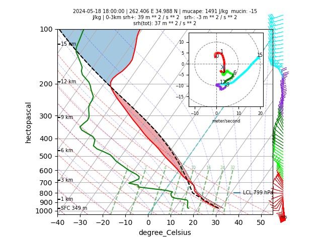

# `cm1` Python Library

## Requirements
- Install Python modules in `environment.yml`
- Install cm1 (`pip install -e .` from CM1 directory).

## Development Setup

This project uses pre-commit to maintain code quality. Please install it before making your first commit:

- Install the tool: `pip install pre-commit` (or `brew install pre-commit` on macOS).
- Install the hooks: Run `pre-commit install` in the root of the repo.


### Get ERA5 sounding for CM1.

```csh
python input/sounding.py 20240518T18 -97.5 35
```

### Expected output
```txt
970.49 305.05 11.89
359.57 305.05 11.89 -0.49 2.71
381.70 304.75 11.63 -0.63 3.47
...
70727.57 3751.06 0.00 -35.85 5.61
73221.89 4084.34 0.00 -38.75 2.34
78498.49 5103.39 0.00 -40.77 -0.17

```

Plot a skew-T diagram.

```csh
python skewt.py 20240518T18 -97.5 35
```


